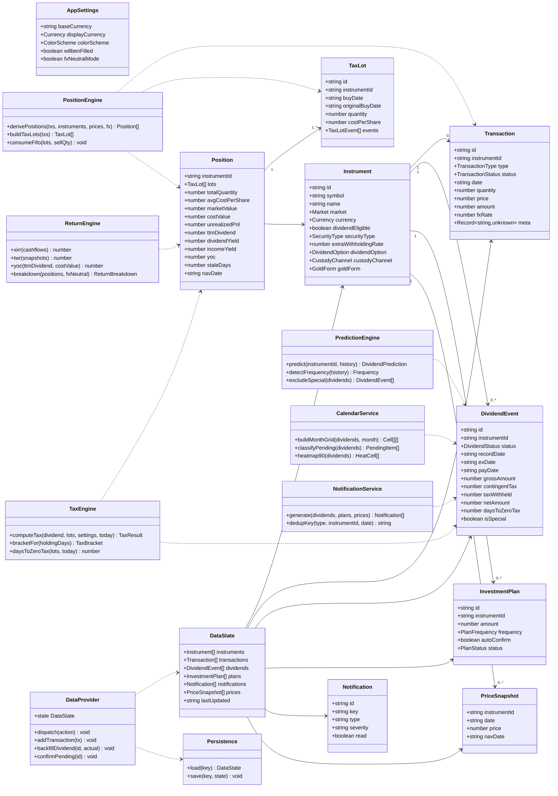
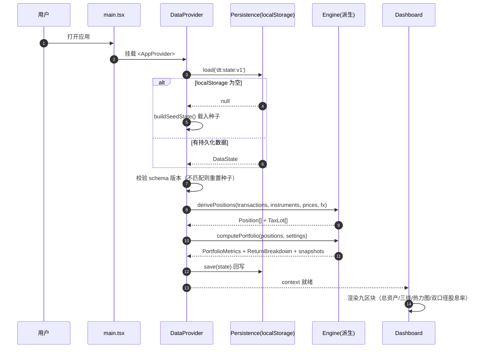
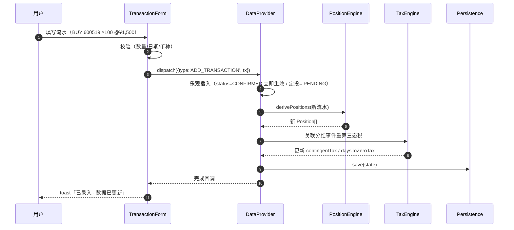
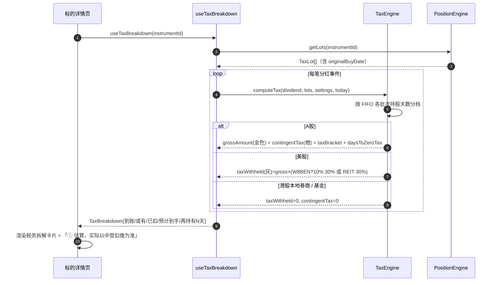
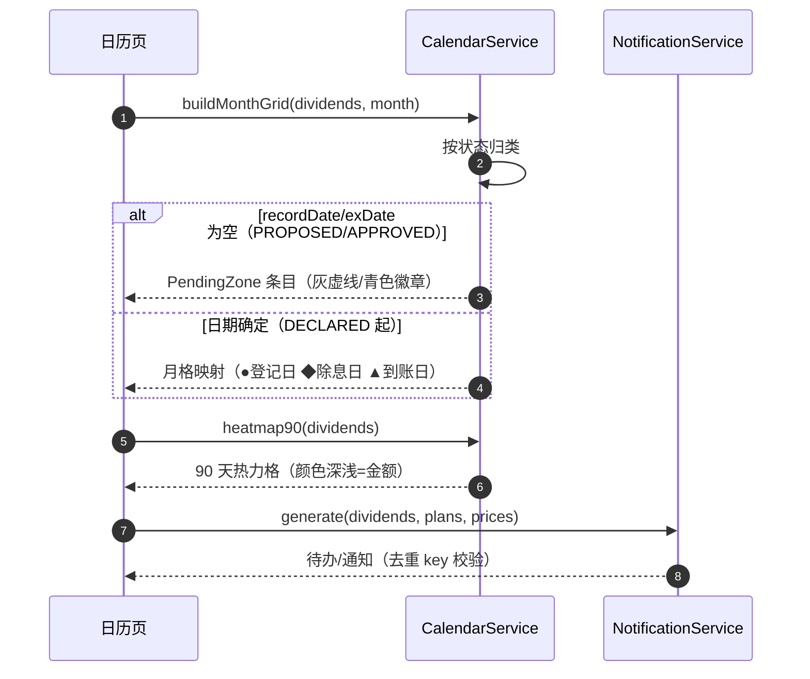

# 个人分红 / 股息追踪系统 · 前端 SPA 技术架构方案

| 项目 | 内容 |
|---|---|
| 文档版本 | v1.0 |
| 日期 | 2026-08-04 |
| 作者 | 高见远（架构师） |
| 上游输入 | PRD v1.0（唯一需求来源，/Users/haoliu/Downloads/PRD.md） |
| 交付范围 | **纯前端 SPA**（本阶段不实现真实数据管道；数据层用静态 JSON 种子 + localStorage 持久化；GitHub Actions 管道文件仅预留占位供未来扩展） |
| 目标目录 | `/Users/haoliu/WorkBuddy/2026-08-04-21-57-39/dividend-tracker/` |

---

## 1. 实现方案 + 框架选型

### 1.1 需求难点分析

| # | 难点 | 本质 | 本方案对策 |
|---|---|---|---|
| D1 | **六类资产统一建模**（A股/港股/美股/基金/加密/黄金） | 不同市场的代码格式、计价币种、税务规则、价格源完全不同，但要进同一张持仓表、同一条曲线 | 单一 `Instrument` 模型 + `market` 判别联合 + 策略分派（税务/价格/格式化按 market 分发），杜绝 if-else 爆炸 |
| D2 | **持仓=交易流水推导 + TaxLot FIFO** | 单一数据源原则；卖出要按 FIFO 消耗批次；送转股持股期限从原股买入日起算 | 纯函数引擎 `PositionEngine`（输入流水 → 输出 TaxLot/Position），`useMemo` 缓存，**不存储推导结果** |
| D3 | **★A股三态税务模型**（已到账/或有税负/已实际扣税） | "先派后税"：派息到账全额，税在卖出时中登补扣；或有税负**每天都在变** | `TaxEngine` 按「当前日期 × FIFO 各批次持股期限」动态分档；产出 `contingentTax`、`daysToZeroTax`（再持有 N 天税负归零） |
| D4 | **诚实的不确定性表达** | 预测拒绝单一数字；历史曲线是近似重建；数据陈旧要打角标；基金净值 T+1 | 预测恒为 `{区间, 置信度, 稳定性评分}`；曲线常驻"近似重建"标注；`StaleBadge`/`NavDateBadge` 组件化 |
| D5 | **信息密度高的交易所风格 UI** | Bloomberg/Binance 风格：深色、等宽数字、右对齐、32-36px 行高、14 列密集表 | 设计 token 系统（CSS 变量 + Tailwind 扩展）；`tabular-nums` + JetBrains Mono 全局数字规范 |
| D6 | 本阶段无真实后端 | 数据从哪来、怎么持久化 | 种子 JSON（覆盖六类资产演示数据）+ localStorage 版本化持久化；预留 `.github/workflows` 与 `scripts/pipeline` 占位 |

### 1.2 框架与库选型（已由 PRD 锁定 + 补充确认）

| 选型 | 版本建议 | 理由 |
|---|---|---|
| React | ^18.3.1 | PRD 锁定；团队熟悉度最高；Context+hooks 足够支撑单用户数据量 |
| Vite | ^5.4.0 | PRD 锁定；秒级冷启动、零配置静态构建，直接对接 Cloudflare Pages |
| TypeScript | ^5.5.4 | PRD 锁定；数据模型复杂，类型即文档 |
| Tailwind CSS | ^3.4.10 | PRD 锁定；配合 design token 做主题化（涨跌色三档切换） |
| ECharts | ^5.5.1 | PRD 锁定；K线/柱状/热力图/折线一站式，canvas 性能满足密集表格页 |
| react-router-dom | ^6.26.0 | 页面路由；v6 稳定 API |
| dayjs | ^1.11.13 | 日期计算（税档天数、日历、定投排期），体积小 |
| clsx | ^2.1.1 | className 合并工具 |
| @fontsource/jetbrains-mono | ^5.1.0 | 等宽数字字体本地化（离线可用，不依赖 CDN） |
| lucide-react | ^0.441.0 | 轻量图标（导航/状态标记），可选 |

**不引入**：redux/zustand（Context 足够）、MUI（与交易所风格冲突，Tailwind 更贴合）、react-query（无远程请求）、Lodash（按需手写工具）。

### 1.3 架构模式

**分层架构（单向数据流）**：

```
┌─────────────────────────────────────────────────────┐
│  View 层  pages/ + components/   （纯展示，无业务逻辑）│
├─────────────────────────────────────────────────────┤
│  Store 层  store/AppContext + DataContext +          │
│            SettingsContext（useReducer + actions）   │
├─────────────────────────────────────────────────────┤
│  Engine 层 lib/calc/*（纯函数、可单测、无副作用）      │
│            position / taxLot / tax / returns /       │
│            prediction / fx / portfolio / calendar    │
├─────────────────────────────────────────────────────┤
│  数据层  types/ + data/seed/* + useLocalStorage       │
└─────────────────────────────────────────────────────┘
```

**关键决策**：
1. **推导不存储**：Position/TaxLot/汇总指标全部由 Engine 从 Transaction 流水推导（`useMemo` 缓存），杜绝数据不一致。
2. **Engine 纯函数化**：所有计算（FIFO、税档、XIRR、预测）无副作用、无 React 依赖，QA 可直接单测。
3. **主题用 CSS 变量**：涨跌色三档切换通过 `<html data-scheme="cn|intl|colorblind">` 切 CSS 变量，无需重渲染整树。
4. **路由用 HashRouter**：纯静态托管零配置（Cloudflare Pages 无需 `_redirects` 规则）；如需 BrowserRouter 可后续加 `public/_redirects`。

---

## 2. 完整文件列表

> 相对路径基于 `/Users/haoliu/WorkBuddy/2026-08-04-21-57-39/dividend-tracker/`。`📦` = 交付实现；`🕳️` = 占位预留（本阶段仅建 README，不实现）。

### 2.1 根配置

| 文件 | 职责 |
|---|---|
| `package.json` | 依赖声明 + scripts（dev/build/preview/typecheck） |
| `vite.config.ts` | Vite 配置（react 插件、路径别名 `@/` → `src/`、build 输出） |
| `tsconfig.json` | TS 编译配置（strict、paths、jsx） |
| `tsconfig.node.json` | Vite 配置文件自身的 TS 配置 |
| `tailwind.config.ts` | Tailwind 扩展：颜色 token、字体族、行高 |
| `postcss.config.js` | PostCSS + Tailwind 插件装配 |
| `index.html` | SPA 入口 HTML（深色背景、字体预载、`#root`） |
| `.gitignore` | 忽略 node_modules/dist/.env 等 |
| `.env.example` | 未来数据管道环境变量示例（本阶段空占位） |
| `README.md` | 运行说明 + 架构摘要 + 未来扩展指引 |
| `public/_redirects` | 🕳️ 未来 BrowserRouter 兜底（`/* /index.html 200`），本阶段可空 |

### 2.2 数据管道预留（🕳️ 本阶段不实现）

| 文件 | 职责 |
|---|---|
| `.github/workflows/README.md` | 预留说明：每日 6/7/16/21 时数据抓取 workflow 的规划（PRD §5.5.1） |
| `scripts/pipeline/README.md` | 预留说明：Python 抓取/回填/汇率 forward-fill 的规划（PRD §3.2.7、附录 A） |

### 2.3 入口与样式

| 文件 | 职责 |
|---|---|
| `src/main.tsx` | 应用入口：挂载 App + HashRouter + AppProvider |
| `src/App.tsx` | 根组件：路由渲染 + 布局装配（T05 集成） |
| `src/vite-env.d.ts` | Vite 类型声明 |
| `src/index.css` | Tailwind 指令 + 全局样式（滚动条、数字规范、背景色） |
| `src/styles/tokens.ts` | **设计 token 唯一来源**：颜色/字体/字号/间距/行高常量 |
| `src/styles/theme.ts` | CSS 变量注入（`data-scheme` 涨跌色三档映射） |

### 2.4 类型与数据（数据层）

| 文件 | 职责 |
|---|---|
| `src/types/index.ts` | **全部 TS 接口**：Instrument/Transaction/TaxLot/Position/DividendEvent/InvestmentPlan/AppSettings/Notification/PriceSnapshot/PortfolioSnapshot/DividendPrediction/ReturnBreakdown/PortfolioMetrics 等 |
| `src/data/seed/instruments.seed.ts` | 种子标的：六类资产各 ≥1（600519.SH、000001.SZ、00700.HK、AAPL、110011、BTC、Au99.99） |
| `src/data/seed/transactions.seed.ts` | 种子流水：BUY/SELL/DIVIDEND_CASH/REINVEST/SPLIT/BONUS/FEE/TAX_WITHHELD 各类型覆盖 |
| `src/data/seed/dividends.seed.ts` | 种子分红事件：覆盖状态机全链路（PROPOSED→APPROVED→DECLARED→EX_DIVIDEND→PAID→RECONCILED） |
| `src/data/seed/prices.seed.ts` | 种子价格快照 + 汇率快照（含基金 navDate、加密长历史） |
| `src/data/seed/plans.seed.ts` | 种子定投计划 |
| `src/data/seed/settings.seed.ts` | 默认设置（CNY 本位币、中国习惯涨跌色、W-8BEN 未填 30%、实物金条） |
| `src/data/index.ts` | 种子聚合器（`buildSeedState()` 返回初始 state） |

### 2.5 Store 层（状态管理）

| 文件 | 职责 |
|---|---|
| `src/store/AppContext.tsx` | 根 Provider：组合 DataContext + SettingsContext |
| `src/store/DataContext.tsx` | 数据 store：useReducer + actions（addTransaction/updateDividend/…）+ 自动持久化 |
| `src/store/SettingsContext.tsx` | 设置 store：主题/币种/W-8BEN/通知渠道等 + 持久化 |
| `src/store/useLocalStorage.ts` | 版本化 localStorage hook（`dt:state:v1`，schema 变更自动重置） |
| `src/store/selectors.ts` | 派生选择器：positions/汇总/待办列表（内部调 Engine） |

### 2.6 Engine 层（纯函数计算）

| 文件 | 职责 |
|---|---|
| `src/lib/format.ts` | 数字/货币/百分比格式化（等宽、右对齐、按资产类型定小数位） |
| `src/lib/calc/position.ts` | `derivePositions()`：流水 → TaxLot 批次 + Position（含市值/盈亏/占比/股息率/YOC） |
| `src/lib/calc/taxLot.ts` | FIFO 消耗、送转/拆分批次调整（持股期限起算日不变） |
| `src/lib/calc/tax.ts` | ★三态税务引擎：A股分档/港股0%/美股10-30%/基金0%；contingentTax + daysToZeroTax |
| `src/lib/calc/returns.ts` | XIRR（牛顿迭代）、TWR（日链式）、YOC |
| `src/lib/calc/prediction.ts` | 派息频率识别、特别股息剔除、CAGR/中位数外推 → 区间+置信度+稳定性评分 |
| `src/lib/calc/fx.ts` | 币种换算（本位币/显示币种、历史汇率、汇率中性模式） |
| `src/lib/calc/portfolio.ts` | 组合快照序列（市值/累计投入/累计分红三线）+ 三段回报拆解 |
| `src/lib/calendar.ts` | 分红日历聚合（月格映射、待定区归类、●◆▲ 标记） |
| `src/lib/notification.ts` | 通知触发规则 + dedup key 生成 |

### 2.7 Hooks

| 文件 | 职责 |
|---|---|
| `src/lib/hooks/usePortfolio.ts` | 组合级派生（总资产、回报拆解、双口径股息率、XIRR/TWR/YOC） |
| `src/lib/hooks/useTaxBreakdown.ts` | 单标的税务拆解（三态 + 再持有 N 天） |
| `src/lib/hooks/useDividendCalendar.ts` | 日历页数据聚合 + 90 天热力图输入 |

### 2.8 通用 UI 组件

| 文件 | 职责 |
|---|---|
| `src/components/ui/Card.tsx` | 卡片容器（#161C26 底、#1F2733 边框） |
| `src/components/ui/Badge.tsx` | 状态徽章（青色/金色/灰/橙/红/绿） |
| `src/components/ui/Button.tsx` / `Input.tsx` / `Select.tsx` | 表单基元（深色主题） |
| `src/components/ui/Modal.tsx` | 弹窗（录入/回填用） |
| `src/components/ui/Table.tsx` | 密集表格基元（32-36px 行高、右对齐数字、排序/隐藏列） |
| `src/components/ui/Tooltip.tsx` | 悬停说明（计算口径、免责声明） |
| `src/components/ui/EmptyState.tsx` | 空态/无分红资产显示 `—` |

### 2.9 图表组件（ECharts 封装）

| 文件 | 职责 |
|---|---|
| `src/components/charts/EChart.tsx` | ECharts 通用封装（resize、主题、按需引入） |
| `src/components/charts/AssetTrendChart.tsx` | 资产走势三线（市值/累计投入/累计分红金）+ "近似重建"角注 + 数据完整度条 |
| `src/components/charts/DividendBarChart.tsx` | 年度分红柱状图（已收实线金柱 / 预测虚线灰柱 + 阴影区间 / 特别股息斜纹柱） |
| `src/components/charts/CalendarHeatmap.tsx` | 90 天分红日历热力图（颜色深浅=金额） |
| `src/components/charts/KlineChart.tsx` | 标的 K 线（30/60/250 日切换，除息日标记） |
| `src/components/charts/Sparkline.tsx` | 持仓表 30 日迷你走势 |

### 2.10 业务组件

| 文件 | 职责 |
|---|---|
| `src/components/dashboard/TickerTape.tsx` | 顶部横向滚动行情条（交易所标志性元素） |
| `src/components/dashboard/TotalAssetHero.tsx` | 总资产大数字（48-56px）+ 当日涨跌 + 币种切换 |
| `src/components/dashboard/ReturnBreakdownCard.tsx` | 三段回报拆解（价格/分红金/汇兑） |
| `src/components/dashboard/YieldDualCard.tsx` | 双口径股息率（整体 vs 收益型） |
| `src/components/dashboard/ReturnMetricsCard.tsx` | XIRR/TWR/YOC 指标卡 |
| `src/components/dashboard/TodoPanel.tsx` | 待办区（待确认 N 笔 / 待处理数据异常 N 条） |
| `src/components/dashboard/DataFreshnessBar.tsx` | 右上角最后更新时间 + 数据源健康指示灯 |
| `src/components/holdings/HoldingsTable.tsx` | 14 列密集持仓表（排序/隐藏列/展开 TaxLot） |
| `src/components/holdings/HoldingsRow.tsx` | 可展开行（TaxLot 明细 + 税档） |
| `src/components/holdings/MarketBadge.tsx` | 市场徽章（A股/HK/US/基金/CRYPTO/GOLD） |
| `src/components/calendar/DividendCalendar.tsx` | 分红日历容器（月视图/时间轴切换） |
| `src/components/calendar/MonthGrid.tsx` | 月视图热力格 |
| `src/components/calendar/PendingZone.tsx` | ★日期待定区（董事会预案/股东大会通过，灰虚线/青色） |
| `src/components/calendar/TimelineView.tsx` | 时间轴视图 |
| `src/components/calendar/DateMarker.tsx` | ●登记日 ◆除息日 ▲到账日 标记（形状区分） |
| `src/components/detail/InstrumentDetail.tsx` | 标的详情容器 |
| `src/components/detail/TaxBreakdownCard.tsx` | ★税务拆解卡片（三态 + "再持有 N 天税负归零" + 免责声明 + 手动覆盖） |
| `src/components/detail/TaxLotTable.tsx` | TaxLot 明细表（买入日/数量/成本/持股期限/税档） |
| `src/components/detail/DividendHistoryTable.tsx` | 分红历史明细（日期/每股/持股数/税前/税率/到手/状态/回填） |
| `src/components/transactions/TransactionList.tsx` | 流水列表（筛选/编辑/删除） |
| `src/components/transactions/TransactionForm.tsx` | 流水录入表单（12 种类型） |
| `src/components/transactions/PendingQueue.tsx` | 待确认队列（PENDING 半透明行 + 批量确认/作废） |
| `src/components/dca/DcaPlanList.tsx` / `DcaPlanForm.tsx` / `DcaExecutionHistory.tsx` | 定投计划列表/表单/执行历史 |
| `src/components/notifications/NotificationCenter.tsx` | 站内通知中心（分类/已读/防重复） |
| `src/components/settings/SettingsPage.tsx` | 设置页容器 |
| `src/components/settings/AppearanceSettings.tsx` | 涨跌色三档 + 显示币种 |
| `src/components/settings/TaxSettings.tsx` | W-8BEN 状态 + 本位币 + 汇率中性模式 |
| `src/components/settings/DataSettings.tsx` | 数据导出 CSV/JSON + 年度目标 |
| `src/components/layout/AppLayout.tsx` | 布局骨架（TopBar + SideNav + Outlet） |
| `src/components/layout/TopBar.tsx` | 顶栏（TickerTape + 健康灯 + 最后更新时间） |
| `src/components/layout/SideNav.tsx` | 侧边导航 |
| `src/components/layout/SubmissionWaiting.tsx` | 录入等待态（进度条 + 90 秒文案 + 已提交回显） |

### 2.11 页面

| 文件 | 职责 |
|---|---|
| `src/pages/DashboardPage.tsx` | Dashboard（PRD §8.4.1 九区块） |
| `src/pages/HoldingsPage.tsx` | 持仓表页 |
| `src/pages/CalendarPage.tsx` | 分红日历页 |
| `src/pages/InstrumentPage.tsx` | 标的详情页 |
| `src/pages/TransactionsPage.tsx` | 流水页 |
| `src/pages/DcaPage.tsx` | 定投页 |
| `src/pages/NotificationsPage.tsx` | 通知中心页 |
| `src/pages/SettingsPage.tsx` | 设置页 |
| `src/pages/SubmissionStatusPage.tsx` | 录入等待态页（模拟提交后流程） |

### 2.12 路由

| 文件 | 职责 |
|---|---|
| `src/router.tsx` | 路由表定义（懒加载页面）+ 布局嵌套 |

---

## 3. 数据模型与接口（TS）

### 3.1 核心接口定义

```ts
// ============ 枚举 ============
export type Market = 'A_SHARE' | 'HK' | 'US' | 'FUND' | 'CRYPTO' | 'GOLD';
export type Currency = 'CNY' | 'USD' | 'HKD';
export type SecurityType = 'COMMON' | 'REIT' | 'MLP_PTP' | 'ADR' | 'ETF' | 'FUND' | 'CRYPTO' | 'GOLD';
export type DividendOption = 'CASH' | 'REINVEST';          // 基金必填
export type CustodyChannel = 'CN_BROKER' | 'HK_LOCAL_BROKER' | 'HK_STOCK_CONNECT' | 'US_BROKER' | 'CEX' | 'SGE' | 'PHYSICAL';
export type GoldForm = 'PHYSICAL' | 'ACCUMULATION' | 'ETF' | 'TD' | 'XAU';
export type TransactionType = 'BUY' | 'SELL' | 'DIVIDEND_CASH' | 'DIVIDEND_REINVEST'
  | 'SPLIT' | 'BONUS' | 'TRANSFER' | 'FUND_SPLIT' | 'FEE' | 'INCOME' | 'TAX_WITHHELD';
export type TransactionStatus = 'CONFIRMED' | 'PENDING' | 'VOIDED';
export type DividendStatus = 'PROPOSED' | 'APPROVED' | 'DECLARED' | 'EX_DIVIDEND' | 'PAID' | 'RECONCILED';
export type PlanFrequency = 'DAILY' | 'WEEKLY' | 'BIWEEKLY' | 'MONTHLY';
export type PlanStatus = 'ACTIVE' | 'PAUSED' | 'ENDED';
export type ColorScheme = 'CN' | 'INTL' | 'COLORBLIND';    // 红涨绿跌 / 绿涨红跌 / 蓝涨橙跌
export type TaxBracket = 'LE1M' | 'M1_1Y' | 'GT1Y' | 'NONE';

// ============ 标的 ============
export interface Instrument {
  id: string;                      // '600519.SH' | '00700.HK' | 'AAPL' | '110011' | 'BTC' | 'Au99.99'
  symbol: string;
  name: string;
  market: Market;
  currency: Currency;              // 计价币种
  dividendEligible: boolean;       // 黄金/不分红成长股 = false → 股息率显示 '—'
  securityType: SecurityType;      // 影响美股税率（REIT/MLP 强制 30%）
  extraWithholdingRate: number;    // ADR 底层国预扣率 0-1，手动填写
  dividendOption?: DividendOption; // 基金必填（强制选择）
  custodyChannel: CustodyChannel;  // 港股: HK_LOCAL_BROKER → 0% 税
  goldForm?: GoldForm;             // 黄金专用（默认 PHYSICAL 实物金条）
  spreadRate?: number;             // 积存金买卖价差率
  dataSourceOverride?: string;
  closed?: boolean;                // 已清仓标记
  tags?: string[];
}

// ============ 交易流水 ============
export interface Transaction {
  id: string;
  instrumentId: string;
  type: TransactionType;
  status: TransactionStatus;       // PENDING 不计入总资产
  date: string;                    // ISO 'yyyy-mm-dd'
  quantity: number;                // 份额/数量（SELL 为负）
  price: number;                   // 每股价格（标的币种）
  amount: number;                  // 总额（标的币种；FEE/INCOME/TAX 用）
  fee?: number;
  currency: Currency;
  fxRate: number;                  // 交易日 → 本位币汇率
  note?: string;
  source?: 'MANUAL' | 'DCA' | 'IMPORT' | 'SYSTEM';
  meta?: Record<string, unknown>;  // {splitRatio, bonusRatio, planId, actualQuantity, dividendId}
}

// ============ 持仓批次（推导产物，不持久化） ============
export interface TaxLot {
  id: string;
  instrumentId: string;
  buyDate: string;
  originalBuyDate: string;         // 送转股沿用原股买入日（影响税档）
  quantity: number;                // 剩余数量
  originalQuantity: number;
  costPerShare: number;            // 本位币成本价
  sourceTxId: string;
  events: { txId: string; date: string; quantity: number; type: 'SELL'|'SPLIT'|'BONUS'|'TRANSFER'|'FUND_SPLIT'|'REINVEST' }[];
}

// ============ 持仓（推导产物） ============
export interface Position {
  instrumentId: string;
  instrument: Instrument;
  lots: TaxLot[];
  totalQuantity: number;
  avgCostPerShare: number;         // 本位币
  marketPrice: number;             // 标的币种现价
  fxRate: number;                  // 当前汇率
  marketValue: number;             // 本位币市值
  costValue: number;               // 本位币成本
  unrealizedPnl: number;
  unrealizedPnlPct: number;
  weightPct: number;
  ttmDividend: number;             // 近 12 个月分红（金色）
  dividendYield: number;           // 整体口径（分母=总资产）
  incomeYield: number;             // 收益型口径（分母=dividendEligible 资产）
  yoc: number;                     // 成本股息率
  annualDividend: number;          // 年化分红（预测）
  staleDays: number;               // 价格陈旧天数
  navDate?: string;                // 基金净值日期（T+1 标注）
}

// ============ 分红事件 ============
export interface DividendEvent {
  id: string;
  instrumentId: string;
  status: DividendStatus;          // 状态机：PROPOSED→APPROVED→DECLARED→EX_DIVIDEND→PAID→RECONCILED
  announceDate?: string;           // 预案公告日
  recordDate?: string;             // 股权登记日（预案阶段为空）
  exDate?: string;                 // 除权除息日（预案阶段为空）
  payDate?: string;                // 派息到账日（A股=除息日+0~3 交易日，估算）
  payDateEstimated: boolean;
  perShareAmount: number;          // 每股金额（标的币种）
  currency: Currency;
  quantityAtRecord: number;        // 登记日持仓数
  grossAmount: number;             // 税前总额（本位币，金色）
  taxRateApplied: number;          // 0-1
  taxWithheld: number;             // 已实际扣税（灰）
  contingentTax: number;           // 或有税负（橙，A股动态）
  netAmount: number;               // 预计最终到手
  actualReceived?: number;         // 用户回填（校准闭环）
  deviationPct?: number;           // 回填后估算偏差率
  taxBracket: TaxBracket;
  daysToZeroTax?: number;          // ★再持有 N 天或有税负归零
  dividendForm: 'CASH' | 'SCRIP' | 'CASH_SCRIP';   // 港股以股代息
  isSpecial?: boolean;             // 特别股息（预测剔除 + 斜纹柱标注）
  isEstimate?: boolean;            // 红利再投份额估算
  manual: boolean;
  sourceKey: string;               // 通知去重 key
}

// ============ 定投计划 ============
export interface InvestmentPlan {
  id: string;
  instrumentId: string;
  amount: number;                  // 每期金额
  frequency: PlanFrequency;
  executionDay: number;            // 周几(0-6) 或 几号(1-31)
  startDate: string;
  endDate?: string;
  holidayPolicy: 'NEXT_TRADING_DAY' | 'PREV_TRADING_DAY';
  monthEndPolicy: 'LAST_TRADING_DAY';
  autoConfirm: boolean;            // 默认 false（诚实做法）
  status: PlanStatus;
  nextRunDate?: string;
}

// ============ 设置 ============
export interface AppSettings {
  baseCurrency: 'CNY' | 'USD';     // 默认 CNY（选定难改）
  displayCurrency: Currency;       // 显示币种（与本位币解耦）
  colorScheme: ColorScheme;        // 默认 CN（中国习惯红涨绿跌）
  w8benFilled: boolean;            // 默认 false → 美股按 30% 保守估算
  fxNeutralMode: boolean;          // 汇率中性模式，默认 false
  annualIncomeTarget?: number;     // 年度被动收入目标（进度只计已到账）
  notificationChannels: { telegram?: string; feishu?: string; wecom?: string };
  quietHours?: { start: string; end: string };
  stalenessThresholdHours: number; // 默认 48
}

// ============ 通知 ============
export interface Notification {
  id: string;
  key: string;                     // 去重：instrumentId+type+date
  type: 'DIVIDEND_PROPOSED' | 'DIVIDEND_DECLARED' | 'RECORD_DATE_CLOSE' | 'EX_DATE'
      | 'PAY_DATE' | 'DCA_PENDING' | 'SOURCE_ERROR' | 'CORP_ACTION' | 'TAX_BRACKET' | 'DATA_STALE';
  title: string;
  body: string;
  severity: 'INFO' | 'WARN' | 'ERROR';
  createdAt: string;
  read: boolean;
  relatedInstrumentId?: string;
}

// ============ 价格/汇率快照 ============
export interface PriceSnapshot {
  instrumentId: string;
  date: string;
  price: number;                   // 标的币种收盘价
  currency: Currency;
  fxRate: number;                  // → 本位币
  source: string;
  navDate?: string;                // 基金净值日期
}
export interface FxSnapshot { date: string; rates: Record<string, number>; }  // {'USDCNY': 7.25}

// ============ 组合快照（近似重建） ============
export interface PortfolioSnapshot {
  date: string;
  marketValue: number;             // 市值
  invested: number;                // 累计投入
  dividends: number;               // 累计分红（金色线）
  isEstimated: boolean;            // 近似重建标注
  dataCompleteness: number;        // 0-1
}

// ============ 推导结果 ============
export interface ReturnBreakdown {
  total: number; totalPct: number;
  price: number; pricePct: number;
  dividend: number; dividendPct: number;   // 金色
  fx: number; fxPct: number;
}
export interface DividendPrediction {
  instrumentId: string;
  frequency: 'YEARLY' | 'SEMI' | 'QUARTERLY' | 'MONTHLY' | 'IRREGULAR';
  lower: number; upper: number;            // 年度区间（本位币）—— 拒绝单一数字
  confidence: 'HIGH' | 'MED' | 'LOW';
  stabilityScore: 1 | 2 | 3 | 4 | 5;       // PRD §3.2.6 五档
  sampleYears: number;
  method: 'CAGR' | 'MEDIAN' | 'NONE';
  specialDividendsExcluded: string[];       // 已剔除的特别股息
  note: string;
}
export interface PortfolioMetrics {
  xirr: number; twr: number; yoc: number;
  overallYield: number; incomeYield: number;
}
export interface TodoItem {
  id: string;
  kind: 'PENDING_TX' | 'DATA_STALE' | 'PAY_BACKFILL' | 'CORP_ACTION' | 'TAX_BRACKET';
  title: string;
  detail: string;
  severity: 'INFO' | 'WARN' | 'ERROR';
}

// ============ Store State ============
export interface DataState {
  instruments: Instrument[];
  transactions: Transaction[];
  dividends: DividendEvent[];
  plans: InvestmentPlan[];
  notifications: Notification[];
  prices: PriceSnapshot[];
  fx: FxSnapshot[];
  lastUpdated: string;             // 种子生成时间/模拟管道更新时间
  sourceHealth: Record<string, { lastSuccess: string; consecutiveFailures: number; status: 'GREEN'|'YELLOW'|'RED' }>;
}
```

### 3.2 类图（Mermaid classDiagram）



---

## 4. 程序调用流（Mermaid sequenceDiagram）

### 4.1 应用初始化（种子/本地持久化 → 派生 → 渲染）



### 4.2 手动录入流水（乐观更新 + 重算 + 持久化）



### 4.3 ★A股税务拆解（三态 + 再持有 N 天归零）



### 4.4 分红日历渲染（待定区 vs 确定日期）



---

## 5. 状态管理与数据流

### 5.1 结构

```
AppProvider (AppContext.tsx)
├── SettingsProvider (SettingsContext.tsx)   → useReducer + useLocalStorage('dt:settings:v1')
└── DataProvider (DataContext.tsx)           → useReducer + useLocalStorage('dt:state:v1')
    └── 派生层（useMemo，内部调 Engine）       → positions / portfolio / calendar / todos
```

### 5.2 DataProvider Actions

| Action | 载荷 | 说明 |
|---|---|---|
| `ADD_TRANSACTION` | `Transaction` | 乐观插入；定投来源置 PENDING |
| `UPDATE_TRANSACTION` / `DELETE_TRANSACTION` | `id, patch` | 编辑/删除（级联重算） |
| `CONFIRM_PENDING` | `id, {actualQuantity?}` | 待确认队列批量确认 |
| `VOID_PENDING` | `id[]` | 批量作废 |
| `UPSERT_DIVIDEND` | `DividendEvent` | 手动新增/修正分红 |
| `BACKFILL_DIVIDEND` | `id, actualReceived` | ★校准闭环，回填后算 deviationPct |
| `OVERRIDE_TAX_WITHHELD` | `id, amount` | 手动覆盖实际扣税 |
| `ADD_NOTIFICATION` | `Notification` | 按 key 去重 |
| `MARK_NOTIFICATION_READ` | `id` | 已读 |
| `UPSERT_PLAN` / `PAUSE_PLAN` / `RESUME_PLAN` / `END_PLAN` | `InvestmentPlan` | 定投 CRUD |
| `GENERATE_DCA_TX` | `planId, date` | 排期到点生成 PENDING 流水 |
| `SET_LAST_UPDATED` | `string` | 模拟管道更新时间 |

### 5.3 持久化与种子

- **版本化 key**：`dt:state:v1` / `dt:settings:v1`。schema 变更时 bump 版本号自动重置（避免旧数据崩溃）。
- **写穿透**：所有 dispatch 经 reducer 后自动 `save()` 到 localStorage（`useEffect` 订阅 state）。
- **种子数据**：`buildSeedState()` 提供六类资产完整演示数据（含状态机全链路分红、PENDING 流水、定投计划、陈旧价格样例），保证首屏即可演示全部 PRD 特性，用户后续在设置页可「清空并重置」。
- **lastUpdated**：种子生成时写入；前端健康灯/陈旧角标基于价格日期与 lastUpdated 计算，为未来接真实管道预留同一套逻辑。

### 5.4 路由表

| 路径 | 页面 | 布局 | 优先级 | 说明 |
|---|---|---|---|---|
| `/` | DashboardPage | AppLayout | P0 | 九区块看板 |
| `/holdings` | HoldingsPage | AppLayout | P0 | 14 列密集持仓表 |
| `/instruments/:id` | InstrumentPage | AppLayout | P1 | K线+分红柱+税务拆解+TaxLot |
| `/calendar` | CalendarPage | AppLayout | P1 | 月视图+待定区+时间轴 |
| `/transactions` | TransactionsPage | AppLayout | P0 | 流水+待确认队列 |
| `/dca` | DcaPage | AppLayout | P2 | 定投计划 |
| `/notifications` | NotificationsPage | AppLayout | P1 | 通知中心 |
| `/settings` | SettingsPage | AppLayout | P0 | 设置 |
| `/submission-status` | SubmissionStatusPage | 独立 | P0 | 录入等待态（模拟） |

路由策略：`HashRouter`（静态托管零配置）；页面级 `React.lazy` 懒加载；`/instruments/:id` 无效 id 重定向回 `/holdings`。

---

## 6. 任务列表（按依赖排序，粒度=模块）

> 硬约束：**≤5 个任务**；每个任务 ≥3 个文件；T01 必须为项目基础设施。依赖链：`T01 → T02 → {T03 ∥ T04} → T05`。

### T01 · 项目基础设施与设计系统基底

| 项 | 内容 |
|---|---|
| 源文件 | `package.json`, `vite.config.ts`, `tsconfig.json`, `tsconfig.node.json`, `tailwind.config.ts`, `postcss.config.js`, `index.html`, `.gitignore`, `.env.example`, `README.md`, `src/main.tsx`, `src/App.tsx`（骨架占位）, `src/index.css`, `src/vite-env.d.ts`, `src/styles/tokens.ts`, `src/styles/theme.ts` |
| 依赖 | 无 |
| 优先级 | P0 |
| 验收 | `npm run dev` 启动空白深色页（#0A0E14）；Tailwind 生效；JetBrains Mono 加载；涨跌色三档 CSS 变量可切换 |

### T02 · 数据层与核心计算引擎（可独立单测）

| 项 | 内容 |
|---|---|
| 源文件 | `src/types/index.ts`, `src/data/seed/*`（6 文件）+ `src/data/index.ts`, `src/store/AppContext.tsx`, `src/store/DataContext.tsx`, `src/store/SettingsContext.tsx`, `src/store/useLocalStorage.ts`, `src/store/selectors.ts`, `src/lib/format.ts`, `src/lib/calc/position.ts`, `src/lib/calc/taxLot.ts`, `src/lib/calc/tax.ts`, `src/lib/calc/returns.ts`, `src/lib/calc/prediction.ts`, `src/lib/calc/fx.ts`, `src/lib/calc/portfolio.ts`, `src/lib/calendar.ts`, `src/lib/notification.ts`, `src/lib/hooks/usePortfolio.ts`, `src/lib/hooks/useTaxBreakdown.ts`, `src/lib/hooks/useDividendCalendar.ts`, `scripts/pipeline/README.md`, `.github/workflows/README.md` |
| 依赖 | T01 |
| 优先级 | P0 |
| 验收 | 种子数据可加载；FIFO 消耗正确；A股三态税（20/10/0 分档 + daysToZeroTax）；美股 10/30/REIT30；XIRR 与 Excel 一致（误差 <0.01%）；预测输出恒为区间+置信度+稳定性；localStorage 读写/版本重置 |

### T03 · 核心业务页面与图表（页面级）

| 项 | 内容 |
|---|---|
| 源文件 | `src/pages/DashboardPage.tsx`, `src/pages/HoldingsPage.tsx`, `src/pages/CalendarPage.tsx`, `src/pages/InstrumentPage.tsx`, `src/pages/TransactionsPage.tsx`, `src/pages/DcaPage.tsx`, `src/components/dashboard/*`（7 文件）, `src/components/holdings/*`（3）, `src/components/calendar/*`（5）, `src/components/detail/*`（4）, `src/components/transactions/*`（3）, `src/components/dca/*`（3）, `src/components/charts/*`（6） |
| 依赖 | T02 |
| 优先级 | P0（Dashboard/Holdings/Transactions）；P1（Calendar/Detail）；P2（Dca） |
| 验收 | Dashboard 九区块齐全（TickerTape/大数字/三段拆解/三线/90天热力图/年度柱/双口径/YOC/待办）；持仓表 14 列 32-36px 行高、可排序隐藏、行展开 TaxLot；日历含待定区+●◆▲；详情页税务拆解卡片含"再持有 N 天"；预测柱实线/虚线/斜纹区分 |

### T04 · 辅助组件/布局/设置/通知/等待态

| 项 | 内容 |
|---|---|
| 源文件 | `src/components/ui/*`（8 文件）, `src/components/layout/*`（4）, `src/components/notifications/NotificationCenter.tsx`, `src/components/settings/*`（4）, `src/pages/NotificationsPage.tsx`, `src/pages/SettingsPage.tsx`, `src/pages/SubmissionStatusPage.tsx` |
| 依赖 | T02（可与 T03 并行） |
| 优先级 | P1 |
| 验收 | 设置页四项开放问题默认值可改（CNY/W-8BEN 未填/中国习惯/实物金条）；涨跌色切换全局生效；通知中心去重+已读；录入等待态 90 秒模拟；响应式（手机端持仓表转卡片流） |

### T05 · 路由集成与构建验证

| 项 | 内容 |
|---|---|
| 源文件 | `src/router.tsx`, `src/App.tsx`（最终集成）, `src/index.css`（打磨）, `README.md`（运行说明收尾）, `public/_redirects` |
| 依赖 | T03, T04 |
| 优先级 | P0 |
| 验收 | 全路由可达；懒加载生效；`npm run typecheck` 0 错误；`npm run build` 通过并产出 `dist/`；QA 交接清单（核心单测点：FIFO/税务/XIRR/预测） |

---

## 7. 依赖包列表（精确版本建议）

```
# dependencies
react@^18.3.1: UI 框架（PRD 锁定）
react-dom@^18.3.1: React DOM 渲染
react-router-dom@^6.26.0: 页面路由（HashRouter 静态托管零配置）
echarts@^5.5.1: 图表（K线/柱状/热力图/折线，PRD 锁定）
dayjs@^1.11.13: 日期计算（税档天数/日历/定投排期）
clsx@^2.1.1: className 合并
@fontsource/jetbrains-mono@^5.1.0: 等宽数字字体（本地化，无 CDN 依赖）
lucide-react@^0.441.0: 图标（可选，导航/状态标记）

# devDependencies
vite@^5.4.0: 构建工具（PRD 锁定）
@vitejs/plugin-react@^4.3.1: Vite React 插件
typescript@^5.5.4: 类型系统（PRD 锁定）
tailwindcss@^3.4.10: 原子 CSS（PRD 锁定）
postcss@^8.4.41: PostCSS
autoprefixer@^10.4.20: 浏览器前缀
@types/react@^18.3.5: React 类型
@types/react-dom@^18.3.0: ReactDOM 类型
```

---

## 8. 共享约定（Engineer 必读）

### 8.1 设计 token（唯一来源 `src/styles/tokens.ts`）

| Token | 值 | 用途 |
|---|---|---|
| `bg-page` | `#0A0E14` | 页面底色（带蓝调近黑） |
| `bg-card` | `#161C26` | 卡片背景 |
| `border-default` | `#1F2733` | 边框/分隔线 |
| `text-primary` | `#E6EAF0` | 主文字 |
| `text-secondary` | `#8B96A8` | 次要文字 |
| `text-disabled` | `#4A5468` | 禁用/占位 |
| `gold-dividend` | `#F0B90B` | ★分红金色（核心语义色，与涨跌色完全区分） |
| `status-declared` | `#00BCD4` | 已宣告（青） |
| `status-prediction` | `#5A6478` | 预测（虚线灰） |
| `status-warning` | `#FFA726` | 警告/或有税负（橙） |
| `status-error` | `#EF5350` | 错误/数据源异常（红） |
| `status-healthy` | `#26A69A` | 健康（绿） |
| `scheme-up / scheme-down` | 随 `data-scheme` 切换 | 涨跌色三档：CN 红/绿、INTL 绿/红、COLORBLIND 蓝/橙 |

涨跌色切换实现：`<html data-scheme="cn|intl|colorblind">` → `theme.ts` 注入 `--scheme-up` / `--scheme-down` CSS 变量 → Tailwind 用 `text-[var(--scheme-up)]` 引用。**全局统一，绝不按市场切换**（PRD §8.2.3 明确决策）。

### 8.2 数字规范（`src/lib/format.ts`）

- 全部数字元素 class：`font-mono tabular-nums text-right`（表格数字不跳动）
- 总资产 48-56px 等宽；表格 13-14px
- 小数位按资产类型：股票 2 位 / 加密 4-8 位 / 份额 2-4 位 / 金额 2 位
- 千分位统一；分红金额一律金色 `text-gold-dividend`
- 不可分红资产（`dividendEligible=false`）股息率列显示 `—`，绝不显示 `¥0.00`

### 8.3 诚实表达组件（必须用于对应场景）

| 场景 | 组件/写法 |
|---|---|
| 历史曲线近似重建 | `AssetTrendChart` 左上角常驻小字 + 数据完整度条（`数据完整度 94% · 7 天使用前值填充`） |
| 预测 | 恒为区间 + 置信度徽章 + 稳定性评分 `●●●○○ 3/5`，**禁止单一数字**；已宣告实线金柱覆盖预测虚线灰柱 |
| 特别股息 | 历史图斜纹柱 + 注明"已从预测中剔除" |
| 数据陈旧 | `⚠ N天前` 角标；>48h Dashboard 顶部红色横幅 |
| 基金净值 | 市值旁固定 `(净值日 08-03)`；QDII 标注 `T+2` |
| 税务估算 | 税务拆解卡片底部 `ⓘ 税额为系统估算，实际以中国结算扣缴为准` |
| A股日期未定 | 分红日历「待定区」+ 方案进度徽章（董事会预案=灰虚线/股东大会通过=青/实施分配=实线） |
| 定投 PENDING | 半透明行 + 虚线边框，不计入总资产，显示"若确认将增加 ¥X" |

### 8.4 命名与文件规范

- 组件文件：`PascalCase.tsx`；hooks：`useXxx.ts`；纯函数：`camelCase`；类型/接口：`PascalCase`；常量：`UPPER_SNAKE`；状态枚举值：`UPPER_SNAKE`
- 路径别名：`@/` → `src/`
- Engine 函数**必须纯函数、无副作用、不 import React**（QA 可单测）
- 类型定义**只允许**在 `src/types/index.ts`，禁止散落各组件
- 业务组件不直接访问 localStorage；一律经 Store actions
- 日期统一 ISO `'yyyy-mm-dd'` 字符串；时间戳 ISO 8601 UTC
- 所有金额字段在 Engine 层统一换算为**本位币**后再进入 UI（UI 层不做汇率计算）
- 颜色引用优先 token 变量，禁止硬编码色值（除 token 定义文件）

---

## 9. 待明确事项（假设已在设置页默认化）

| # | 事项 | 本阶段默认假设 | 影响面 |
|---|---|---|---|
| Q1 | 记账本位币 | **CNY**（设置页可改，改后提示"历史成本口径将变化"） | 全部金额换算 |
| Q2 | 美股 W-8BEN | **未填 → 30% 保守估算**；设置页顶部常驻黄色横幅提示 | 美股税务 |
| Q3 | 黄金持有形式 | **实物金条**（无持续费用，估值用上金所 Au99.99） | 估值/费用 |
| Q4 | 涨跌色方案 | **中国习惯（红涨绿跌）**，设置页可切三档 | 全局配色 |
| Q5 | 定投顺延策略 | 顺延至下一交易日 + 月末顺延至最后交易日（PRD §13 Q10 建议默认） | 定投排期 |
| Q6 | 年度被动收入目标 | 实现（进度只计已到账），默认不设目标 | Dashboard |
| Q7 | 通知渠道 | 本阶段仅站内通知中心；Webhook 配置留设置项但无真实推送 | 通知 |
| Q8 | 历史补录范围 | 种子数据演示到 2023-01；真实回填引擎属未来管道阶段 | 曲线回溯 |
| Q9 | GitHub Actions 连通性验证 | 属未来数据管道阶段（P0 前置），本阶段仅预留占位文件 | 架构风险 R1 |

**边界声明**：本阶段为纯前端交付，所有"自动更新/抓取/推送"以模拟数据 + 种子 lastUpdated 呈现交互形态；真实数据管道（Python + Actions + Pages Functions 代理）留待下一阶段，文件占位已在 §2.2 预留。

---

*文档结束 · v1.0 · 2026-08-04 · 架构师高见远*
